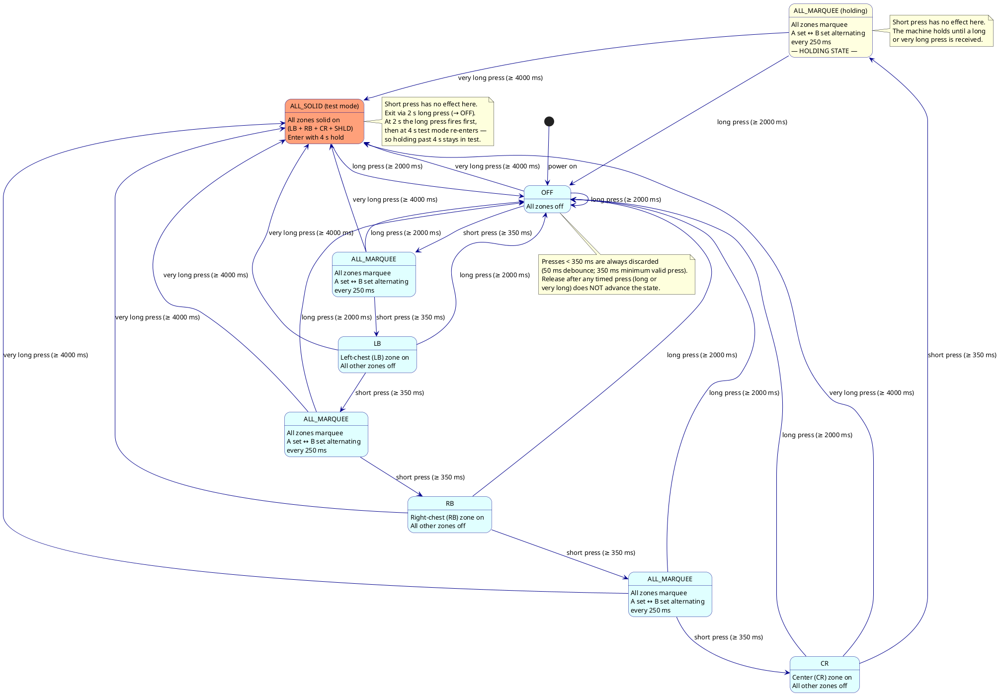

# Costume LED State Machine

```plantuml
@startuml Costume LED State Machine

skinparam state {
    BackgroundColor LightCyan
    BorderColor DarkBlue
    ArrowColor DarkBlue
    FontSize 13
}

[*] --> OFF : power on

state OFF : All zones off
state "ALL_MARQUEE" as AM1 : All zones marquee\nA set ↔ B set alternating\nevery 250 ms
state LB                   : Left-chest (LB) zone on\nAll other zones off
state "ALL_MARQUEE" as AM2 : All zones marquee\nA set ↔ B set alternating\nevery 250 ms
state RB                   : Right-chest (RB) zone on\nAll other zones off
state "ALL_MARQUEE" as AM3 : All zones marquee\nA set ↔ B set alternating\nevery 250 ms
state CR                   : Center (CR) zone on\nAll other zones off
state "ALL_MARQUEE (holding)" as AM_HOLD #LightYellow : All zones marquee\nA set ↔ B set alternating\nevery 250 ms\n— HOLDING STATE —
state "ALL_SOLID (test mode)" as TEST #LightSalmon : All zones solid on\n(LB + RB + CR + SHLD)\nEnter with 4 s hold

' Normal cycle — short press (≥ 350 ms)
OFF --> AM1  : short press (≥ 350 ms)
AM1 --> LB   : short press (≥ 350 ms)
LB  --> AM2  : short press (≥ 350 ms)
AM2 --> RB   : short press (≥ 350 ms)
RB  --> AM3  : short press (≥ 350 ms)
AM3 --> CR   : short press (≥ 350 ms)
CR  --> AM_HOLD : short press (≥ 350 ms)

' Long press (2 s) — resets to OFF from any state
OFF     --> OFF : long press (≥ 2000 ms)
AM1     --> OFF : long press (≥ 2000 ms)
LB      --> OFF : long press (≥ 2000 ms)
AM2     --> OFF : long press (≥ 2000 ms)
RB      --> OFF : long press (≥ 2000 ms)
AM3     --> OFF : long press (≥ 2000 ms)
CR      --> OFF : long press (≥ 2000 ms)
AM_HOLD --> OFF : long press (≥ 2000 ms)
TEST    --> OFF : long press (≥ 2000 ms)

' Very long press (4 s) — enters test mode from any state
OFF     --> TEST : very long press (≥ 4000 ms)
AM1     --> TEST : very long press (≥ 4000 ms)
LB      --> TEST : very long press (≥ 4000 ms)
AM2     --> TEST : very long press (≥ 4000 ms)
RB      --> TEST : very long press (≥ 4000 ms)
AM3     --> TEST : very long press (≥ 4000 ms)
CR      --> TEST : very long press (≥ 4000 ms)
AM_HOLD --> TEST : very long press (≥ 4000 ms)

note right of AM_HOLD
  Short press has no effect here.
  The machine holds until a long
  or very long press is received.
end note

note right of TEST
  Short press has no effect here.
  Exit via 2 s long press (→ OFF).
  At 2 s the long press fires first,
  then at 4 s test mode re-enters —
  so holding past 4 s stays in test.
end note

note bottom of OFF
  Presses < 350 ms are always discarded
  (50 ms debounce; 350 ms minimum valid press).
  Release after any timed press (long or
  very long) does NOT advance the state.
end note

@enduml
```
